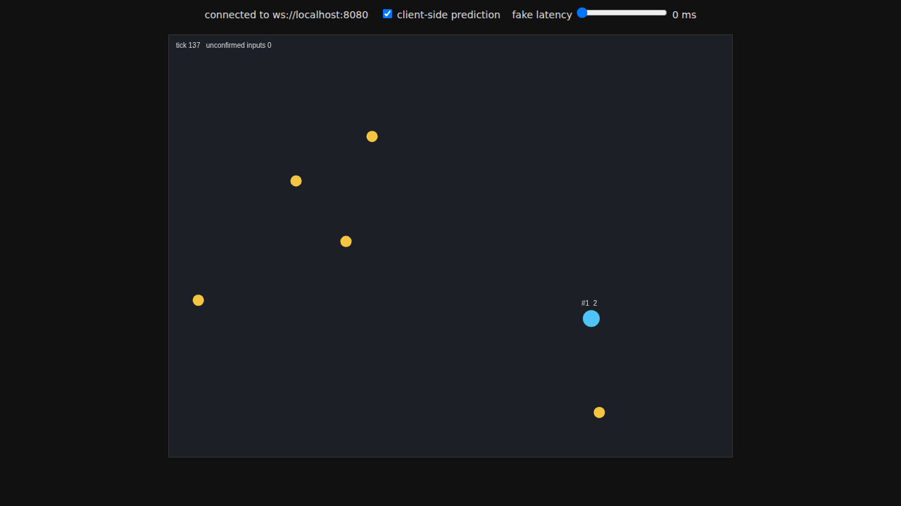

# Authoritative Arena


A small real-time multiplayer server in Java. Players move around an arena and collect coins, and **the server decides everything**. Clients only send "I want to move this direction." Where you actually are, and whether you actually picked up a coin, is the server's call.

It also comes with a browser client that does client-side prediction and reconciliation, so movement feels instant even though the server is in charge.



## Why build it this way

In a multiplayer game you can't trust the client. If the client reports its own position, a cheater can teleport. If it reports its own pickups, a cheater can grab every coin on the map. So the server runs the real simulation, and clients are just input devices with a renderer.

The catch is latency. If you wait for the server before moving your character, every keypress feels laggy. The standard fix is to predict locally and correct when the server disagrees. This project implements both halves.

## How it works

### Server (`src/main/java/.../arena`)

- **Fixed tick loop.** `GameServer` runs `World.step()` 20 times a second on one dedicated thread, then broadcasts a snapshot of the world to every client.
- **Single-threaded simulation, no locks.** WebSocket callbacks run on the library's network threads, and they never touch game state. They just push events (join, leave, input) onto a `ConcurrentLinkedQueue`. The tick thread drains that queue at the start of each tick. All game logic runs on one thread, so it needs no locking.
- **Input validation** in `World.submit()` and `GameServer.parseInput()`:
  - The player ID comes from the socket connection, never from the message, so you can't send inputs as someone else.
  - Direction vectors longer than 1 are clamped: sending `dx: 50` gets you normal speed.
  - NaN and infinity are rejected.
  - Sequence numbers must keep increasing, so replayed or out-of-order packets are dropped.
  - Each player's input queue has a size cap, and oversized messages are ignored.
- **Speed-hack protection.** Each input is one frame of movement. A token bucket gives every player 3 frames of budget per tick (60 Hz input / 20 Hz tick), with a little room to bank for network jitter. Send 300 inputs at once and you still move at normal speed; the extras just wait in the queue.
- **Server-side pickups.** Coin collection is checked against server positions only.

### Client (`client/index.html`)

- Sends one input per frame, with a sequence number.
- **Prediction:** applies its own input right away using the same movement math as the server.
- **Reconciliation:** each snapshot includes `lastSeq`, the last input the server applied for you. The client snaps to the server's position, drops the inputs the server has confirmed, and replays the rest on top.
- There's a fake-latency slider and a toggle to turn prediction off, so you can see the difference. Set it to 200 ms, then flip prediction on and off.

## Running it

Requires Java 21 and Maven.

```bash
mvn package
java -jar target/authoritative-arena-1.0.0-all.jar        # listens on ws://localhost:8080
```

Then open `client/index.html` in a browser (open it in two windows to see two players). Move with WASD or the arrow keys.

## Tests

```bash
mvn test
```

The tests go after the simulation directly:

- flooding 100 inputs in one tick doesn't move you faster than the budget allows
- sustained input spam is capped at the per-tick rate
- a direction of `(50, 0)` moves you the same distance as `(1, 0)`, and diagonals aren't faster
- replayed and out-of-order sequence numbers are dropped
- NaN / infinity rejected, players can't leave the arena, the input queue is bounded
- a player ID inside the JSON payload is ignored in favor of the connection's ID
- malformed messages are rejected without throwing

## Things I'd add next

- Interpolate other players between snapshots so they move smoothly instead of stepping at 20 Hz
- Delta snapshots, sending only what changed, to cut bandwidth
- Send snapshots over a binary format instead of JSON
- Spatial partitioning for pickup checks once there are a lot of players and coins
